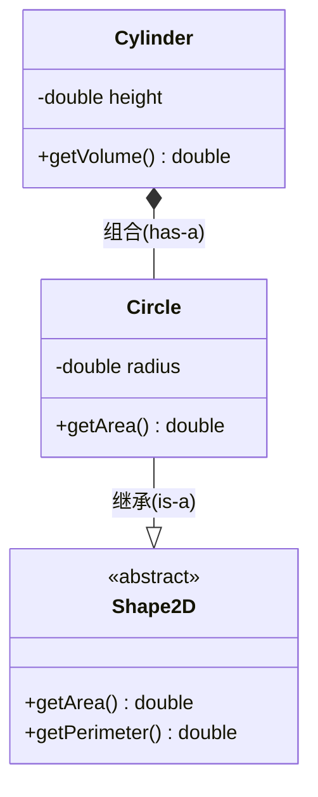

# UML 类图：怎么画、怎么看

> 关联笔记：[[对象的复用]]、[[对象复用的具体例子]]、[[继承]]、[[成员变量]]、[[面向抽象编程]]

## 一句话解释

==**UML 是一套"用图说话"的通用符号：把类和类之间的关系画成一张图，让别人不看你代码也能懂结构。画的时候规矩是死的（符号有固定含义），读的时候只要抓住两个东西——每个"框"里有什么、每条"线"两端是什么。**==

本笔记聚焦 ==**类图（Class Diagram）**==——这是 [[对象的复用]]、[[继承]] 里唯一用到的那种 UML 图，也是学面向对象最该先掌握的一张图。其他类型的图（用例图、时序图……）只在第一节过一眼。

---

## 一、先看全貌：UML 有哪些图

UML 图分两大类，学 Java 面向对象**只会经常用到"类图"**：

| 类别 | 图 | 回答什么问题 | 入门阶段 |
| --- | --- | --- | --- |
| **结构图**（画"有什么"） | **类图** Class Diagram | 有哪些类、类之间什么关系 | ✅ **重点** |
| | 对象图 Object Diagram | 运行期某时刻的对象快照 | 了解 |
| | 组件图 / 部署图 | 系统由哪些模块、装在哪台机器 | 了解 |
| **行为图**（画"怎么动"） | 用例图 Use Case | 用户能做什么 | 了解 |
| | 时序图 Sequence | 对象之间按时间先后怎么调 | 有用 |
| | 活动图 Activity | 业务流程 / 算法步骤 | 了解 |
| | 状态图 State | 一个对象的状态怎么流转 | 了解 |

> [!tip] 记忆法
> **结构图回答"静态有什么"，行为图回答"动态怎么动"。** 本节只需要一类——**结构图里的类图**。

---

## 二、画一个类：三栏框

类图里，**一个类就是一个矩形**，竖着切成三栏：

```
┌────────────────────────────┐
│          Circle            │  ← ① 类名
├────────────────────────────┤
│ - radius : double          │  ← ② 属性（字段）
├────────────────────────────┤
│ + getArea() : double       │  ← ③ 方法（操作）
│ + setRadius(r : double)    │
└────────────────────────────┘
```

规矩就三条：

1. **第一栏**：类名。**抽象类**类名用*斜体*（手写时也可写成 `Circle {abstract}`）。
2. **第二栏**：属性，格式 ==**`可见性 名称 : 类型`**==。
3. **第三栏**：方法，格式 ==**`可见性 名称(参数) : 返回类型`**==。**抽象方法**用*斜体*。

### 可见性符号（别写错）

| 符号 | 含义 | 对应 Java |
| --- | --- | --- |
| `+` | public | `public` |
| `-` | private | `private` |
| `#` | protected | `protected` |
| `~` | package | 默认（不写修饰符） |

> [!note] 两个常被忽略的细节
> - **静态成员**：名字下面画**下划线**（如 `+count : int` 表示 `static`）。
> - **接口**：用构造型标注 `«interface»`，或把整个框画成"棒棒糖"——但初学阶段**直接用类框 + `«interface»` 最清楚**。

---

## 三、类与类的关系：六种线（核心）

这是类图的灵魂。**同样的两个类，线画错，语义就错了。** 按"耦合由弱到强"排列：

```
依赖   A ┄┄┄▶ B        虚线 + 开口箭头      "用一下"
关联   A ────▶ B        实线（可带箭头）     "持有引用"
聚合   A ◇──── B        空心菱形（在A端）    "有，但可独立"
组合   A ◆──── B        实心菱形（在A端）    "有，同生共死"
泛化   A ────▷ B        实线 + 空心三角（指向B）  "是一种"（继承）
实现   A ┄┄┄▷ B        虚线 + 空心三角（指向B）  "实现接口"
```

### 1. 依赖（dependency）—— uses-a

**A 只是"用到"B**，不是长期持有：B 出现在 A 的方法**参数、局部变量、静态调用**里。

```java
class Order {
    public void pay(Payment p) {   // Payment 只是参数，用完就走
        p.doPay();
    }
}
```
画法：`Order ┄┄▶ Payment`（虚线 + 开口箭头，==**箭头指向被依赖的 B**==）。

### 2. 关联（association）—— has-a 的"结构版"

**A 长期持有 B 的引用**——本质就是 [[成员变量]] 里存了个引用（见 [[对象的引用和实体]]）。

```java
class Customer {
    private Address addr;   // 长期持有的成员 → 关联
}
```
画法：`Customer ──▶ Address`。**箭头是可选的**：
- **带箭头**（`——▶`）= **导航性**，表示"只能 A 找到 B"；
- **不带箭头**（`——`）= 双向可导航。

### 3. 聚合（aggregation）—— 弱的"有"

空心菱形。==**菱形永远画在"整体"那一端**==。含义：整体和部分是"**可以分开**"的——车队解散，车还在。

```java
class Fleet {
    private List<Car> cars;   // 车可以被多支车队共享 / 独立存在
}
```
画法：`Fleet ◇── Car`（空心菱形贴 `Fleet`）。

### 4. 组合（composition）—— 强的"有"

实心菱形。同样==**菱形画在整体端**==。含义：部分**随整体一起生灭**——车毁了，车上那台发动机也一起没了。这就是 [[对象的复用]] 里 `Car ◆── Engine`、[[对象复用的具体例子]] 里 `Cylinder ◆── Circle` 的画法。

```java
class Car {
    private final Engine engine = new Engine();  // 车造出来发动机就跟着造，车没了它也走
}
```
画法：`Car ◆── Engine`。

### 5. 泛化 / 继承（generalization）—— is-a

**实线 + 空心三角，三角形紧贴父类那一端。** 这就是 [[继承]] 里 `Car extends Vehicle` 的画法：

```java
class Car extends Vehicle { }   // Car is-a Vehicle
```
画法：`Car ──▷ Vehicle`（==**空心三角指向父类**==）。

### 6. 实现（realization）—— 实现接口

**虚线 + 空心三角，三角贴接口那一端。** 与泛化的区别只在"实线变虚线"：

```java
class Circle implements Shape { }   // 实现接口
```
画法：`Circle ┄┄▷ Shape`（==**虚线**==空心三角指向接口）。

> [!warning] 最容易画错的四处
> 1. **菱形在"整体"端**，不是部分端。写成 `Engine ◆── Car` 就完全反了。
> 2. **空心三角永远指向父类/接口**，不是子类。方向反了语义就反了。
> 3. **继承是实线、实现是虚线**，三角都是空心的。
> 4. **组合（实心菱形）vs 聚合（空心菱形）**——见下一节。

---

## 四、组合 vs 聚合 vs 关联：一句话分清

三者都是"持有引用"，区别只在**生命周期**和**画法强度**：

| 关系 | 画法 | 生命周期 | 判据 |
| --- | --- | --- | --- |
| **关联** | 实线（可带箭头） | 不确定 | 只是"长期认识/持有" |
| **聚合** | **空心**菱形 | 部分**可独立** | "含有，但分开也活得下去" |
| **组合** | **实心**菱形 | 部分**随整体生灭** | "没了整体，部分也没有意义" |

> [!tip] 一句话判据
> ==**"整体没了，部分还活着吗？"**== 活着 → 聚合（空心）；一起没 → 组合（实心）。
>
> 注意：日常口语里的"组合"往往泛指"把对象当成员"（==即 UML 的**关联**==），而 UML 里的"组合"是更严格的"同生共死"。[[对象的复用]] 里那句提醒就是这个意思。

---

## 五、多重性：一对多怎么画

关系两端可以标**数量**，读作"一个 A 对应几个 B"：

| 写法 | 含义 |
| --- | --- |
| `1` | 恰好一个 |
| `0..1` | 零个或一个 |
| `*` 或 `0..*` | 零个或多个 |
| `1..*` | 至少一个 |
| `n..m` | n 到 m 个 |

例：==**一支球队有 1 名教练、11 到 23 名球员**==：

```
┌──────────┐  1        1..*  ┌──────────┐
│   Team   │───employed──────│  Player  │
└──────────┘                  └──────────┘
```
读作："`Team` 关联 `Player`，一端 1、一端 1..*"，即**一个队有一到多名球员**。数字写在**靠近哪一端的角色**旁，别标反。

---

## 六、怎么读一张 UML 类图（读图五步）

拿到一张陌生类图，按这个顺序走，不会晕：

1. **数框**——有几个类？哪些是接口（`«interface»`）/ 抽象类（*斜体*）？
2. **读三栏**——每个类**有什么字段、能调什么方法**？可见性符号看是 `+` 还是 `-`（这就是它的"对外接口"边界）。
3. **顺线读关系**——从每条线两端看符号：
   - 空心三角 → 谁继承/实现了谁；
   - 菱形 → 谁"拥有"谁，实心还是空心；
   - 箭头 → 谁引用谁、往哪边导航；
   - 虚线 → 只是"用一下"还是"实现"。
4. **看多重性**——`1` 对 `*` 表示一对多，据此知道该用单个对象还是 `List`/数组。
5. **翻译成代码**——每条线都有 Java 对应物：见下表。

### 关系 → Java 代码 对照表（读图的落点）

| 图上符号 | 读作 | Java 写法 |
| --- | --- | --- |
| 实线 + 空心三角 | is-a | `class A extends B` |
| 虚线 + 空心三角 | 实现 | `class A implements B` |
| 实心菱形 | 组合（同生共死） | `private B b = new B();` |
| 空心菱形 | 聚合（可独立） | `private List<B> bs;`（外部塞进来） |
| 实线 + 箭头 | 关联（持有引用） | `private B b;` |
| 虚线 + 箭头 | 依赖（用一下） | 出现在**方法参数 / 局部变量**里 |

> [!tip] 读图口诀
> ==**"先看框里有什么，再看线两端是什么；三角找父类，菱形找整体，箭头指被用的一方；数字定数量，实线是长期、虚线是一下。"**==

---

## 七、怎么"画"出来（工具）

- **纸笔 / ASCII**：本笔记库的 [[对象的复用]]、[[对象复用的具体例子]] 用的就是 ASCII 框，够用、好改、能塞进 Markdown。
- **Mermaid**：==Obsidian 原生支持==，直接写在代码块里就能渲染，**推荐日常使用**：

````markdown

````

Mermaid 的写法与符号对照：

| Mermaid 写法 | 含义 |
| --- | --- |
| `A --\|> B` | A 继承 B（泛化，实线空心三角） |
| `A ..\|> B` | A 实现接口 B（虚线空心三角） |
| `A *-- B` | A 组合 B（实心菱形在 A 端） |
| `A o-- B` | A 聚合 B（空心菱形在 A 端） |
| `A --> B` | A 关联 B（带箭头实线） |
| `A ..> B` | A 依赖 B（虚线箭头） |

- **专门工具**：PlantUML（纯文本）、draw.io（拖拽）、StarUML。**入门阶段 Mermaid 足够**。

---

## 八、注意事项

1. **框里只放"结构"，不放实现**。类图画字段和方法签名，**不写方法体**。
2. **可见性符号别省**。`+`/`-` 直接体现封装边界——被 `-` 包住的字段，别的类不该碰。
3. **菱形在整体端、三角在父类端**，这两个方向错了整张图就反了。
4. **组合（实心）要慎用**：它表示"同生共死"，别把该共享的对象错误地独占（见 [[对象的引用和实体]] 里"引用共享"的坑）。
5. **关联的箭头表示导航性**，不代表数据流向。
6. **优先面向抽象**：成员类型的框尽量写成接口/抽象类，这正是 [[面向抽象编程]] 在类图上的体现。
7. **图是给人看的，要克制**。一张图只画相关的类，别把整个系统塞进来——否则等于没画。

---

## 九、一句话总结

> ==**类是"三栏框"（类名 / 属性 / 方法，`+ - # ~` 标可见性）；类之间的关系按耦合由弱到强是：依赖（虚线箭头）、关联（实线）、聚合（空心菱形）、组合（实心菱形）、继承（实线空心三角）、实现（虚线空心三角）——三角永远指向父类，菱形永远在整体端；两端数字表示多重性；读图就是"先看框里有什么，再看线两端是什么，最后翻译成 Java 代码"。**==

---

## 关联笔记

- [[对象的复用]] —— 继承 / 组合 / 委托三条路，对应本笔记的泛化与菱形
- [[对象复用的具体例子]] —— `Cylinder ◆── Circle` 的完整实例，看图落地
- [[继承]] —— 泛化（空心三角）在 Java 里的写法
- [[面向抽象编程]] —— 为什么成员类型要写成接口 / 抽象类
- [[成员变量]] —— 关联 / 组合的本质就是"成员变量"
- [[对象的引用和实体]] —— 图上一条线，代码里是一个指向堆的引用
